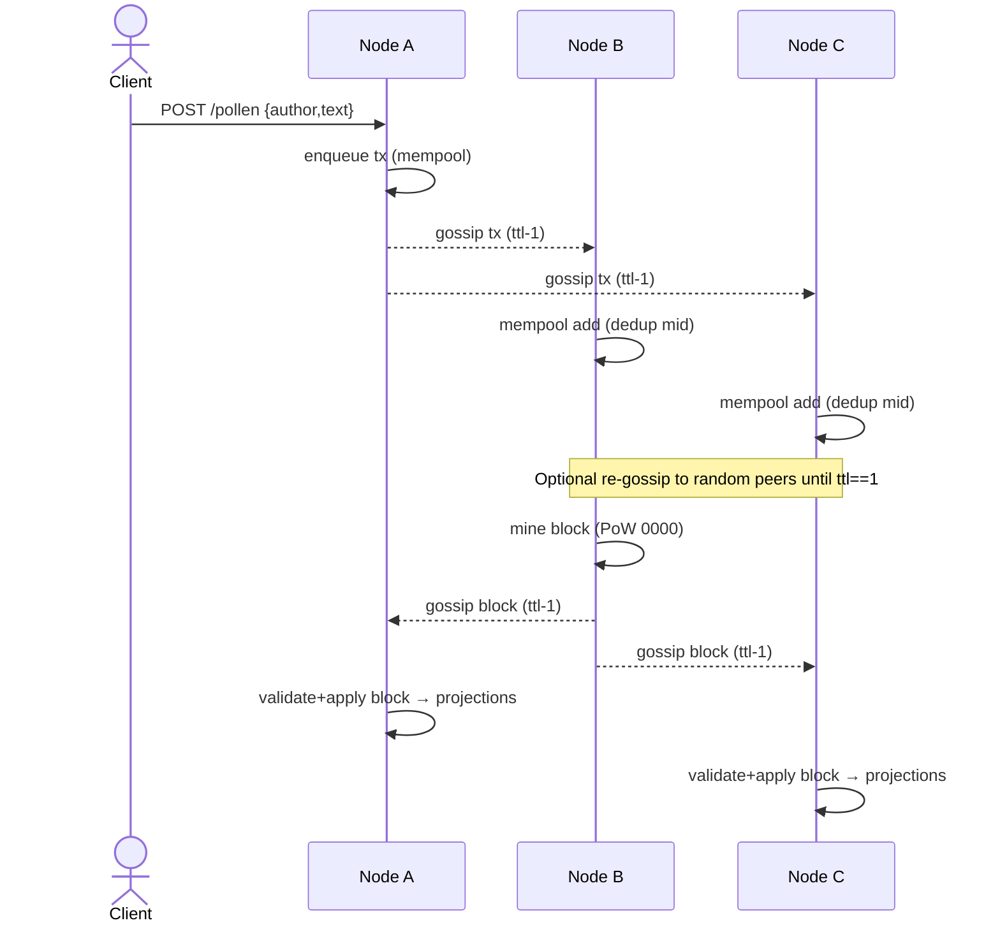

# NodeChain — Decentralized Blockchain Backend (Fastify + SQLite)

A real backend for a Twitter/X-like social platform built on a decentralized blockchain. Each node is self-contained, stores data in SQLite, exposes the same APIs, and communicates via gossip and periodic anti-entropy sync. The primary social artifact is called a “Pollen” (a user’s public content item). Legacy names like “Post” remain for compatibility.

---

## 1. High-Level Overview
- **Purpose.** Power a social feed where users publish, reply, follow, and like. All social actions become transactions, mined into blocks via PoW, and replicated across peers.
- **Operating model.** There is no central service. Nodes are equal, each with their own DB and API.
- **Reliability model.** Best-effort gossip plus periodic pull-based sync; eventual consistency.

### Core Features
- Simple Proof-of-Work (leading hash prefix `0000`).
- Transaction mempool and block mining.
- P2P gossip for transactions and blocks with TTL/fanout.
- Periodic anti-entropy sync across peers.
- Optional Ed25519 signed transactions.
- Social features: users, pollens (posts), replies, follows, likes, timeline, search (#hashtags).
- Per-node Swagger UI at `/docs`.

---

## 2. Architecture (Per-node, No Central Services)
```
node1/
  index.js           # entry
  server.js          # Fastify server + routes + gossip
  util.js            # sha256, PoW helpers, time utils
  db.js              # SQLite schema + queries
  blockchain.js      # genesis, mining, validation
  p2p.js             # gossip (TTL/fanout), peer exchange
  projection.js      # apply blocks to social tables
  types.js           # TX kinds (USER_REGISTER, POLLEN, ...)
  crypto.js          # canonical digest + Ed25519 verify
  node.config.json   # config
node2/               # mirrors node1
```

---

## 3. Concepts & Terminology
- **Pollen.** Primary content item (formerly “Post”). Endpoints `/pollen`, `/pollen/reply`, and listing `/user/:handle/pollens`.
- **Transaction.** A unit of state intent; represented as `{ id, from, to, content, timestamp }` in mempool/blocks.
- **Block.** Append-only batch of transactions satisfying PoW. Fields: `index, timestamp, prevHash, nonce, txs, hash`.
- **Mempool.** Pending transactions awaiting inclusion into a block.
- **Projection.** Deterministic application of transactions into SQL tables for fast queries (users, posts, follows, likes).
- **Gossip.** Epidemic dissemination with TTL and random fanout; envelopes carry `{ t, d, ttl, mid, sender }`.

---

## 4. Data Model (SQLite)
Tables (key columns only):
- `blocks(height PK, hash, prevHash, timestamp, nonce, txs JSON)`
- `mempool(id PK, sender, recipient, content, timestamp)`
- `users(handle PK, displayName, pubkey, createdAt)`
- `posts(id PK, author, text, tags JSON, parentId, timestamp, blockIndex)`
- `follows(follower, followee, timestamp, blockIndex, PK(follower,followee))`
- `likes(postId, liker, timestamp, blockIndex, PK(postId,liker))`

---

## 5. Lifecycles
### 5.1 Transaction lifecycle
1) Client submits `/tx` or `/tx/signed`.
2) Node validates and enqueues into `mempool`.
3) Node gossips to a random subset (fanout) with TTL.
4) Another node mines a block and includes the tx.
5) Blocks propagate via gossip; projections update SQL tables.

### 5.2 Mining lifecycle
1) Node reads mempool → constructs block base.
2) PoW search for nonce s.t. `hash` starts with `0000`.
3) On success, persist block, clear included mempool entries.
4) Apply projection, gossip block with TTL/fanout.

### 5.3 Sync lifecycle
1) Periodically call `/sync` to pull `GET /blocks?fromHeight=N` from peers.
2) Validate and apply new blocks, update projections.

---

## 6. Networking
### 6.1 Gossip envelope
`{ t: 'tx'|'block', d: <payload>, ttl: <int>, mid: <msg-id>, sender: <url> }`
- **TTL.** Decrements at each hop; forwarding stops at 1.
- **Fanout.** Random subset of peers to avoid broadcast storms.
- **Dedup.** Nodes track `seenMsgs` by `mid`.

### 6.2 Peer exchange
- `POST /peers/exchange` lets peers bi-directionally merge peer sets.
- Periodic task fetches peer lists and exchanges to grow the view.

---

## 7. Configuration (`nodeX/node.config.json`)
Keys:
- `port` number
- `dbPath` string
- `difficulty` number (PoW zeros)
- `peers` string[]
- `self` string (this node’s base URL)
- `gossipFanout` number (default 2)
- `gossipTTL` number (default 2)
- `syncIntervalMs` number (default 10000)
- `peerExchangeIntervalMs` number (default 20000)

---

## 8. API Reference
### 8.1 Core
- `GET /health`
- `GET /chain`
- `GET /mempool`
- `POST /tx` `{ from, to, content }`
- `POST /tx/signed` `{ id, from, to, content, timestamp, pubkey, signature }`
- `POST /mine`
- `GET /peers`
- `POST /peers` `{ url }`
- `POST /peers/exchange` `{ peers?: string[] }` → `{ peers: string[] }`
- `GET /blocks?fromHeight=N`
- `POST /receive-block` (compat)
- `POST /sync`
- `POST /gossip/tx` (accepts envelope or bare tx)
- `POST /gossip/block` (accepts envelope or bare block)

### 8.2 Social
- `POST /users/register` `{ handle, displayName?, pubkey? }`
- `GET /users/:handle`
- `POST /pollen` `{ author, text, tags? }`  (primary)
- `POST /pollen/reply` `{ author, text, parentId }`  (primary)
- `GET /user/:handle/pollens` (primary)
- `POST /post` `{ author, text, tags? }` (compat)
- `POST /reply` `{ author, text, parentId }` (compat)
- `GET /user/:handle/posts` (compat)
- `GET /timeline/:handle` `(limit?, offset?)`
- `GET /search?q=` (supports `#hashtag`)

---

## 9. Examples (cURL)
Register users:
```bash
curl -X POST http://localhost:3001/users/register -H 'content-type: application/json' -d '{"handle":"alice","displayName":"Alice"}'
curl -X POST http://localhost:3002/users/register -H 'content-type: application/json' -d '{"handle":"bob","displayName":"Bob"}'
```

Publish a pollen and mine:
```bash
curl -X POST http://localhost:3001/pollen -H 'content-type: application/json' -d '{"author":"alice","text":"Hello #Pollen"}'
curl -X POST http://localhost:3001/mine
```

Follow and view timeline:
```bash
curl -X POST http://localhost:3002/follow -H 'content-type: application/json' -d '{"follower":"bob","followee":"alice"}'
curl -X POST http://localhost:3002/mine
curl http://localhost:3002/timeline/bob
```

Signed transaction (Ed25519):
```bash
curl -X POST http://localhost:3001/tx/signed -H 'content-type: application/json' -d '{
  "id":"<uuid>",
  "from":"alice",
  "to":"posts",
  "content":"{\"kind\":\"pollen\",\"author\":\"alice\",\"payload\":{\"text\":\"Signed hello\"}}",
  "timestamp":1690000000000,
  "pubkey":"<hex-ed25519-pubkey>",
  "signature":"<hex-ed25519-signature>"
}'
```

---

## 10. Security Model
- **Integrity.** Use `/tx/signed` with Ed25519 verification for authenticated authorship.
- **Transport.** Consider TLS reverse proxy and mutual authentication in untrusted networks.
- **Abuse controls.** Rate limit, peer allowlists, and message size caps.
- **Deduplication.** `seenMsgs`/`seenTx`/`seenBlocks` suppress reprocessing.
- **Persistence.** Separate DB files per node; back up periodically.

---

## 11. Limitations & Future Work
- Fork-choice and reorg policies (e.g., longest chain, GHOST).
- Peer discovery and authenticated gossip.
- Economic layer: balances, fees, rewards.
- Storage pruning/snapshotting for long runs.
- Stronger identity + key rotation, mandatory signatures.

---

## 12. Glossary
- **Pollen** — Primary content item (formerly “Post”).
- **Reply** — A Pollen referencing `parentId`.
- **Follow/Like** — Social relations stored as projection rows.
- **Envelope** — Gossip wrapper with `ttl`/`mid` for controlled spread.
- **Projection** — Deterministic SQL mutation from block txs.

---

## 13. Architecture & Gossip (Mermaid)


---

## 14. Advanced Examples

### 14.1 Reply and Like
```bash
# reply to an existing pollen (id=POL123)
curl -X POST http://localhost:3001/pollen/reply \
  -H 'content-type: application/json' \
  -d '{"author":"alice","text":"@bob thanks!","parentId":"POL123"}'

# like a pollen
curl -X POST http://localhost:3002/like \
  -H 'content-type: application/json' \
  -d '{"liker":"bob","postId":"POL123"}'

# mine to seal the actions
curl -X POST http://localhost:3002/mine
```

### 14.2 Search by hashtag
```bash
curl 'http://localhost:3001/search?q=%23pollen'
```

### 14.3 Pagination on timeline and pollens
```bash
# timeline
curl 'http://localhost:3002/timeline/bob?limit=10&offset=0'
curl 'http://localhost:3002/timeline/bob?limit=10&offset=10'

# list a user's pollens
curl 'http://localhost:3001/user/alice/pollens?limit=5&offset=0'
curl 'http://localhost:3001/user/alice/pollens?limit=5&offset=5'
```

---

## 15. Config Presets

### 15.1 Small Dev Mesh (2–5 nodes)
```json
{
  "port": 3001,
  "dbPath": "data/node1.sqlite",
  "difficulty": 4,
  "peers": ["http://localhost:3002"],
  "self": "http://localhost:3001",
  "gossipFanout": 2,
  "gossipTTL": 2,
  "syncIntervalMs": 10000,
  "peerExchangeIntervalMs": 20000
}
```

### 15.2 Wider Mesh (10–50 nodes)
```json
{
  "port": 3001,
  "dbPath": "data/node1.sqlite",
  "difficulty": 4,
  "peers": ["http://hostA:3001","http://hostB:3001"],
  "self": "http://myhost:3001",
  "gossipFanout": 3,
  "gossipTTL": 3,
  "syncIntervalMs": 8000,
  "peerExchangeIntervalMs": 15000
}
```
